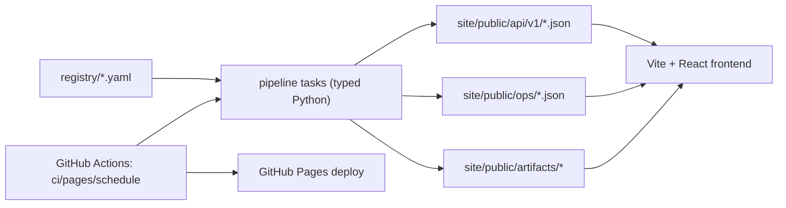

# Portfolio-as-a-System

Capability-first personal site where automation is the product:

- `registry/` is the only hand-authored data surface.
- `pipeline/` ingests + normalizes + computes metrics + emits public artifacts.
- `site/` renders strictly from generated JSON endpoints.

## One-command local reproduction

```bash
make check && make pipe-run && make site-build
```

This runs validation/tests/typecheck/build, generates `site/public/*`, and builds `site/dist`.

## Architecture



## Public APIs

- `/api/v1/status.json`
- `/api/v1/projects.json`
- `/api/v1/publications.json`
- `/api/v1/metrics.json`
- `/api/v1/search-index.json`
- `/api/v1/profile.json`
- `/ops/latest-run.json`
- `/ops/dag.json`
- `/ops/provenance.json`

Artifact endpoints:

- `/artifacts/resume.pdf`
- `/artifacts/github/repos.raw.json`
- `/artifacts/semantic-scholar/publications.raw.json`

## Automation observability

- Site ops console: `/ops/console`
- Site data index: `/data`
- GitHub Actions workflows:
  - `ci.yml` (quality gates)
  - `pages.yml` (push/manual deploy)
  - `schedule.yml` (weekly automated refresh + deploy)

## GitHub Pages configuration

1. Open repository `Settings`.
2. Open `Pages`.
3. Set `Source` to `GitHub Actions`.
